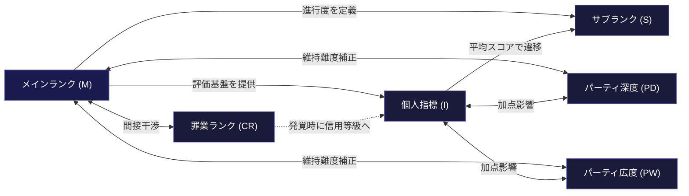

## 第2章：システム全体構造

### 2-1. 二層構造

本システムはギルドの内部管理情報と、外部に公開する簡易情報の二層で構成される。ギルドにとっては全モジュールが内部情報であり、対外ランクはその内部情報を元にギルドが外向けに発行する翻訳でしかない。

|層|誰から誰へ|役割|内容|
|---|---|---|---|
|対外ランク|ギルド → 一般社会|外に出す看板|S・A・B等の簡易等級。依頼主や市民が参照する|
|内部ランク|ギルド内で完結|冒険者の管理・評価・運用の全て|メインランク、サブランク、個人指標、パーティ指標、罪業ランクの全モジュール|

冒険者同士のやり取りは「内部ランクを互いに知っている者同士の会話」として成立する。同じギルドの仲間であれば当然知っているし、異なるギルドの相手でも冒険者同士であれば符丁として通じる。一般市民や依頼主には対外ランクしか見えない。

### 2-2. モジュール一覧と依存関係

本システムを構成する全モジュールの一覧と、それぞれの依存関係を以下に定義する。

|モジュール|記号|内容|依存先|性質|
|---|---|---|---|---|
|メインランク|M|冒険者の格を定義する。系統運用方式の選択を含む|なし|コアモジュール。全構成で必須|
|サブランク|S|ランク内の進行度を示す|Mが必須|拡張モジュール。Mに接続して機能|
|個人指標|I|数値による評価と昇降格判定|Mが必須|拡張モジュール。昇降格の駆動装置|
|パーティ深度|PD|固定パーティの絆の深さ|なし|独立モジュール。単体で機能可能|
|パーティ広度|PW|即席連携の適応力の広さ|なし|独立モジュール。単体で機能可能|
|罪業ランク|CR|犯罪歴の管理と裏評価|なし|独立モジュール。単体で機能可能|

コアモジュールであるメインランク（M）のみが全構成で必須となる。メインランクモジュールの導入時には、使用するメインランクパターン（彼岸花式または龍姫式）の選択に加え、龍姫式を採用する場合は系統運用方式（第4章 4-5節参照）の選択が設計者の判断事項となる。その他のモジュールは全て拡張または独立モジュールであり、作品の必要に応じて自由に選択・接続できる。

モジュール間の接続ルールは以下の通り。

|接続|関係|干渉ルール|
|---|---|---|
|M → S|サブランクはメインランク内の進行度|Sが最上段に到達でMの昇格条件が開放される|
|M → I|個人指標がサブランク遷移を駆動|Iの平均スコアがSの段階を決定する|
|M ←→ PD / PW|上位ランクほどパーティ維持が困難|Mのランクに応じてPD / PWに維持難度の補正がかかる|
|I ←→ PD / PW|パーティ経験が一部指標に影響|PDは信用等級・指導実績に加点、PWは地域貢献度・信用等級に加点|
|M ←→ CR|犯罪ランクが信用等級と背反|CRの上昇は信用等級（TR）に減点圧力を与える（発覚した場合）|

### 2-3. 構成テンプレート

作品のタイプに応じて推奨されるモジュール構成を以下に示す。これはあくまで目安であり、自由にカスタマイズしてよい。

| テンプレート名 | 使用モジュール        | 想定用途                 |
| ------- | -------------- | -------------------- |
| 最小構成    | Mのみ            | 短編。ランクが背景設定程度の作品     |
| 標準構成    | M＋S＋I          | 中編。冒険者の成長を描く作品       |
| 関係性重視構成 | M＋S＋I＋PD＋PW    | 長編。パーティの絆や関係性がテーマの作品 |
| 裏社会構成   | M＋S＋I＋CR       | 長編。光と闇の二面性がテーマの作品    |
| フル構成    | M＋S＋I＋PD＋PW＋CR | 大長編・群像劇。世界そのものを描く作品  |

最小構成ではメインランクだけで「こいつは何者か」を表現し、モジュールを追加するたびに冒険者の描写が立体的になっていく。フル構成では全モジュールが相互に干渉し合い、「全ての軸を同時に高めることの不可能性」という構造的矛盾が物語の燃料として機能する。

各テンプレートにおける総段階数の目安は以下の通り。メインランクパターンと系統運用方式の選択により変動する。

| テンプレート       | 彼岸花式（単一系統）                 | 龍姫式・二系統      | 龍姫式・三系統                      |
| ------------ | -------------------------- | ------------ | ---------------------------- |
| 最小構成（Mのみ）    | 9                          | 18           | 27                           |
| 標準構成（M＋S）    | 54（花命環系6段階）                | 126（生死環系7段階） | 189（生死環系7段階×2系統＋蛻変環系7段階×1系統） |
| フル構成（全モジュール） | 上記×個人指標・パーティ指標・罪業ランクの組み合わせ | 同左           | 同左                           |

※表中の「二系統」は作品内で二つの系統を使用する場合（性別固定方式等）、「三系統」は三つの系統を使用する場合（キャラクター個別選択方式等）を指す。系統運用方式の詳細は第4章 4-5節を参照。三系統統一選択方式のように一つの系統のみを使用する場合は、彼岸花式（単一系統）の列に準じて計算する。なお、標準構成の段階数はサブランク体系の推奨接続（第5章 5-5節参照）に従った場合の値である。推奨と異なる接続を行う場合は段階数が変動する。

### 2-4. チャームシステム

ランク情報の参照はICチップ内蔵のチャーム（紋章系装身具）を通じて行われる。チャームにはギルドが管理する全モジュールの情報が格納されており、提示またはリーダー（読取装置）にかざすことで情報が参照可能になる。

チャームの型は以下の5種から自由に選択でき、複数所持も可能である。どの型でも格納されている情報は同一であり、機能的な差はない。

|型|形状|装着|特徴|
|---|---|---|---|
|メダリオン型|円形紋章メダル|首 / 胸|正式な場での身分提示に向く。存在感がある|
|印章型|紋章入り指輪|指|契約時の押印にも使える。片手で提示可能|
|腕輪型|紋章入りバングル|手首|戦闘中も邪魔にならない。実用重視|
|結晶型|紋章内包の魔石|ペンダント / 携帯|リーダーにかざすと紋章が投影表示される|
|硬貨型|紋章入りコイン|携帯自由|テーブルに置く、投げて見せる等の演出向き|

チャームの運用仕様は以下の通り。

|項目|内容|
|---|---|
|型の選択|5種から自由。複数所持も可|
|情報の同期|どの型でも格納されている情報は同一|
|認証方法|提示またはリーダーにかざす|
|紛失時|ギルドで再発行。旧チャームは無効化される|
|偽造対策|ギルドの魔法的・技術的な固有署名が埋め込まれている|

閲覧権限はかざす先によって変化する。

| 場面            | 見える情報                     | 見えない情報           |
| ------------- | ------------------------- | ---------------- |
| 一般市民・依頼主に提示   | 対外ランク（S〜F等）               | 内部ランク全般          |
| 冒険者同士で提示      | 対外ランク＋メインランク＋サブランク＋パーティ指標 | 個人指標の詳細スコア、罪業ランク |
| ギルド施設のリーダー    | 全情報（罪業ランクを除く）             | 罪業ランク            |
| ギルド上層部の専用リーダー | 全情報                       | なし               |

罪業ランクが通常のリーダーに表示されない点が重要である。最も危険な人物のチャームをかざしても通常のリーダーでは何も表示されず、外見上は一般の冒険者と区別がつかない。これは罪業ランクの「本当に危ない者は見えない」という設計思想と一致する。

---
