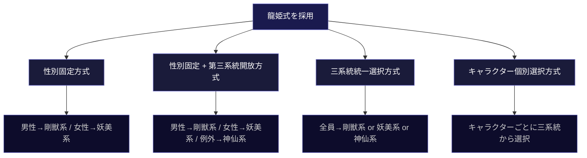

## 第4章：メインランクモジュール（M）

### 4-1. 設計思想

メインランクは冒険者の「格」を定義するコアモジュールであり、全構成で必須となる唯一のモジュールである。メインランクの設計にあたっては、ランク名を構成する三つの要素を分離して扱うことを推奨する。

|要素|役割|例（龍姫式・剛獣系）|
|---|---|---|
|ラベル|呼び名。格の雰囲気を直感的に伝える|龍、玄、麒、獏、鵺、蛟、鬼、狼、兎|
|基準|そのランクに到達するための客観条件|個人指標の平均スコア、昇格試験の合格等|
|フレーバー|そのランクにいる人間に見られがちな傾向や物語的意味|「全てを超え、地上との繋がりを失った者」等|

ラベルは作中のキャラクターが口にする呼称であり、基準はギルドが判定に使う客観的な条件であり、フレーバーは設定資料に記載される物語的な背景情報である。この三つを混同しないことで、システムとしての判定機能と物語としての深みを両立できる。

### 4-2. パターンA：花名型（彼岸花式・ひがんばなしき）

「業の深さ」を軸としたメインランク。上位に進むほど幸せから遠ざかる構造を持ち、昇格が祝福ではなく呪いに近い意味を帯びる。9段階、単一系統。

|ランク|ラベル|読み|フレーバー|
|---|---|---|---|
|9（最下位）|百合|ゆり|穢れを知らない無垢。まだ世界に触れていない|
|8|チューリップ|ちゅーりっぷ|優しさだけで生きようとする者。幻想の中にいる|
|7|桜|さくら|美しく散る自己陶酔。悲劇に酔える段階|
|6|紫陽花|あじさい|信念が定まらない揺らぎ。迷い、変節の季節|
|5（中位）|薔薇|ばら|愛と暴力の表裏。人を愛し、人を傷つけた者|
|4|椿|つばき|美しいまま落ちる潔さ。罪を背負って堕ちる覚悟|
|3|水仙|すいせん|自己を見つめ続ける孤独。己の業と向き合い続ける者|
|2|蓮|はす|泥を栄養に変える力。汚濁を糧にできる者|
|1（最上位）|彼岸花|ひがんばな|死後に咲く真実。全ての業を超えた先にいる者|

彼岸花式の特徴は、花言葉や文化的背景がそのままフレーバーとして機能する点にある。百合の「純潔」、椿の「首ごと落ちる花」、彼岸花の「此岸と彼岸の境界」といった既存の文化的イメージが、説明なしに雰囲気を伝える。

### 4-3. パターンB：幻獣構造型（龍姫式・りゅうきしき）

龍姫式は複数の系統を持つ分岐型ランク構造である。各系統は異なるテーマと異なるラベル群で構成され、同じランク番号でも系統によって全く異なるドラマを内包する。各9段階。

龍姫式は三つの系統を持つ。剛獣系（力と意志の変遷）、妖美系（美と情念の変遷）、神仙系（境界上の変容）である。三系統27ラベルは全て固有であり、重複はない。

どの系統を使うか、どのように系統を割り当てるかは、作品ごとに設計者が決定する系統運用方式（4-5節参照）に従う。

#### 4-3-1. 剛獣系（ごうじゅうけい）

力と意志の変遷を軸とする系統。ラベルは全て獣・幻獣で構成される。

|ランク|ラベル|読み|フレーバー|
|---|---|---|---|
|9（最下位）|兎|うさぎ|自らを差し出すことしかできない未熟な献身|
|8|狼|おおかみ|仲間のために戦えるが、一人では脆い|
|7|鬼|おに|感情が力になったが、制御できない|
|6|蛟|みずち|力を持て余し、暴走と挫折の間にいる|
|5（中位）|鵺|ぬえ|何者でもない混沌。自分を見失っている|
|4|獏|ばく|他者を救えるが、自分の夢を喰われている|
|3|麒|き|慈悲を知り、力の振るい方を見失った者|
|2|玄|げん|相反する二つを一身に収めた者|
|1（最上位）|龍|りゅう|全てを超え、地上との繋がりを失った者|

#### 4-3-2. 妖美系（ようびけい）

美と情念の変遷を軸とする系統。ラベルは全て人型または人型に近い存在で構成される。

|ランク|ラベル|読み|フレーバー|
|---|---|---|---|
|9（最下位）|蝶|ちょう|美しいが脆い。風に流されるだけの存在|
|8|狐|きつね|賢さと美で生き延びるが、本性を隠し続ける|
|7|人魚|にんぎょ|愛のために自分の一部を差し出した者|
|6|天女|てんにょ|力はあるのに、何かに縛られて飛べない|
|5（中位）|鬼女|きじょ|愛が反転して破壊になった者|
|4|産女|うぶめ|命を生み出す痛みを知った者|
|3|白蛇|はくじゃ|純粋な想いが毒にも薬にもなる者|
|2|鳳|おおとり|一度燃え尽きて蘇った者。元の自分はもういない|
|1（最上位）|姫|ひめ|全ての妖美を超え、名前すら不要になった者|

#### 4-3-3. 神仙系（しんせんけい）

境界上の変容を軸とする系統。道教の神仙思想を思想的基盤とし、ラベルは全て状態・概念で構成される。剛獣系が生き物、妖美系が人型であるのに対し、神仙系は一つも生き物を含まない。この質感の分離により、ラベルを一つ聞いただけで系統の判別が可能になる。

上位に進むほど存在の輪郭が曖昧になり、最終的には定義そのものを拒否する地点に到達する。これは剛獣系の「力を極めた果てに地上を失う」、妖美系の「美を極めた果てに名を超える」とは異なる第三の到達点であり、「変容を極めた果てに存在の定義以前に還る」という帰結を示す。

|ランク|ラベル|読み|フレーバー|
|---|---|---|---|
|9（最下位）|霞|かすみ|まだ人の形をしているが、何かが薄い。俗世の輪郭が滲み始めた者|
|8|童|わらべ|歳を重ねても核が変わらない。成長を拒む純粋さ、あるいは停滞|
|7|翳|かげり|光が陰り始めた。実体と虚像の間で揺れている。何かが失われつつあるが、何を失っているのか本人にもわからない|
|6|丹|たん|自らを炉に入れた。変わろうとする意志はあるが、焼かれている最中|
|5（中位）|壺|つぼ|内と外の区別が曖昧になった。自分の中に世界があるのか、世界の中に自分がいるのか|
|4|遊|ゆう|目的を手放した。どこへ行くのでもなく、ただ在る。自由と虚無の境界|
|3|夢|ゆめ|自分が自分である確信が溶けた。夢の中にいるのか、夢そのものになったのか|
|2|虚|きょ|全てを手放した空洞。しかしその空洞にこそ全てが流れ込む|
|1（最上位）|道|みち|名づけた瞬間に失われるもの。存在の定義を超えた先にある、定義以前の何か|

#### 4-3-4. 三系統のラベル質感分離

三系統のラベルは意図的に異なるカテゴリから選定されている。

|系統|ラベルのカテゴリ|質感|
|---|---|---|
|剛獣系|生き物（獣・幻獣）|実体がある。触れる。噛まれる|
|妖美系|人型または人型に近い存在|姿が見える。語りかけてくる|
|神仙系|状態・概念|触れない。掴めない。そこにあるのかもわからない|

#### 4-3-5. 三系統対照表

同じランク番号に位置する三系統のラベルを対照し、それぞれが内包するドラマの差異を示す。

|ランク|剛獣系|妖美系|神仙系|三系統の対照|
|---|---|---|---|---|
|9|兎（未熟な献身）|蝶（脆い美）|霞（滲む輪郭）|力がない、形がない、存在が薄い。三つの「まだ何もない」だが、その「なさ」の質が全て異なる|
|8|狼（仲間がいないと脆い）|狐（本性を隠す）|童（成長を拒む）|依存、偽装、停滞。三つの「未成熟の形」|
|7|鬼（制御できない暴力）|人魚（自己犠牲の愛）|翳（何かが陰り始める）|暴走、献身、喪失。同じ「危うさ」の三つの顔|
|6|蛟（暴走と挫折の間）|天女（縛られて飛べない）|丹（焼かれている最中）|持て余す、縛られる、焼かれる。三つの「苦しみの質」|
|5|鵺（自己喪失の混沌）|鬼女（愛の反転破壊）|壺（内外の境界崩壊）|何者でもない、愛が壊れた、世界が歪んだ。三つの「崩壊の中心」|
|4|獏（他者を救い自分が喰われる）|産女（命を生む痛み）|遊（目的の放棄）|消耗、産苦、解放。三つの「手放し方」|
|3|麒（慈悲ゆえの迷い）|白蛇（毒にも薬にも）|夢（自他の溶解）|正しさがわからない、善悪が混ざる、自分が誰かわからない。三つの「確信の喪失」|
|2|玄（相反を一身に収める）|鳳（燃え尽きて蘇る）|虚（空であることの充溢）|統合、再生、空虚。三つの「超越の手前」|
|1|龍（地上を失った）|姫（名を超えた）|道（定義を拒否した）|繋がりの喪失、名前の超越、存在の定義以前への回帰。三つの孤独の頂点|

### 4-4. 龍姫式における逆転構造

龍姫式の三系統にはそれぞれ逆転構造が組み込まれている。

剛獣系では「鬼」が第7位（下位寄り）に置かれている。鬼は一般的に強大な存在として認識されるが、このシステムでは「感情が制御できない未熟さ」として下位に配置されている。

妖美系では「天女」が第6位に置かれている。天女は一般的に高貴な存在だが、「力があるのに縛られて飛べない」という未達成の状態として配置されている。

神仙系では「夢」が第3位（上位寄り）に置かれている。夢は一般的に柔らかく無害な印象だが、自他の境界が溶解した極めて高位の到達点として配置されている。同様に「壺」が第5位に置かれているが、壺中天という宇宙論的な概念を背負う高度な境地である。

いずれの逆転も「なぜ？」という問いを誘発し、その問いへの回答が世界観の説明として自然に機能する。逆転構造は独自命名型の「初見で序列がわからない」という欠点を、「問いが物語を駆動する」という利点に転換する手段である。

### 4-5. 系統運用方式

龍姫式を採用する場合、三系統をどのように運用するかは作品ごとに設計者が決定する。以下の四つの運用方式を定義する。

|方式|内容|系統の決まり方|適した作品|
|---|---|---|---|
|性別固定方式|男性は剛獣系、女性は妖美系。神仙系は使用しない|性別が系統を決定する|二項対立を明確に描きたい作品。最もシンプル|
|性別固定＋第三系統開放方式|男性は剛獣系、女性は妖美系を基本とし、いずれにも属さない存在に神仙系を開放する|性別が基本系統を決定し、例外として神仙系が存在する|二項対立を基盤としつつ、そこから逸脱する存在を描きたい作品|
|三系統統一選択方式|性別に関係なく、作品全体で一つの系統を選択して使用する|設計者が作品単位で系統を決定する|単一系統の深みを掘り下げたい作品。系統間の対比は不要な場合|
|キャラクター個別選択方式|性別に関係なく、キャラクターごとに三系統のいずれかを選択して適用する|キャラクターの本質が系統を決定する|群像劇。多様なキャラクターの対比がテーマの作品|

系統運用方式はメインランクモジュール（M）の設定項目であり、他のモジュールには影響しない。どの方式を選んでも、サブランク・個人指標・パーティ指標・罪業ランクの各モジュールはそのまま機能する。

キャラクター個別選択方式を採用した場合、系統の選択そのものがキャラクター情報として機能する。力と意志で生きる者は剛獣系を、美と情念で生きる者は妖美系を、境界上で変容し続ける者は神仙系を選ぶ。同じパーティ内に異なる系統のキャラクターが混在し、系統間の対照が日常的に発生する。「お前は龍を目指すのか」「私は姫なんかじゃない、道を歩く」といった会話が、キャラクターの生き方の違いをそのまま映し出す。

### 4-6. 独自メインランクの作り方

本資料のアイデアストックをそのまま使用してよいが、自分の作品の世界観に合わせて独自のメインランクを設計することもできる。その場合は以下の手順を推奨する。

**手順1：軸を決める。** ランクが上がるにつれて何が変化するのかを一言で定義する。彼岸花式なら「業の深さ」、龍姫式剛獣系なら「力と意志の変遷」、妖美系なら「美と情念の変遷」、神仙系なら「境界上の変容」。この軸が定まらないとランク名の選定基準がぶれる。

**手順2：段階数を決める。** 作品の規模に応じて5・7・9段階から選ぶ（第1章 1-4節参照）。

**手順3：最下位と最上位を先に決める。** 両端が決まれば中間は自然に埋まる。最下位は「出発点の象徴」、最上位は「到達点の象徴」として、軸の意味が最も凝縮された名前を選ぶ。

**手順4：中間を埋める。** 最下位から最上位へ向かう過程で、軸に沿った変化の段階を名前で表現する。隣り合うランク同士の差が均等に感じられるように調整する。

**手順5：逆転構造を検討する。** 直感的に格上に見える名前を下位に配置することで、「なぜ？」という問いが誘発され、物語への導入装置として機能する。導入が不要な場合は素直な序列でも構わない。

**手順6：ラベル・基準・フレーバーを分離して記述する。** ランク名（ラベル）を決めたら、到達条件（基準）と物語的意味（フレーバー）をそれぞれ別に記載する。この分離が、システムとしての機能と設定としての深みを両立させる。

**手順7：複数系統を設計する場合はラベルの質感分離を確認する。** 系統間でラベルのカテゴリが異なることを確認する。全系統のラベルを一覧にし、重複がないこと、一語聞いただけで系統が判別できることを検証する。

---
